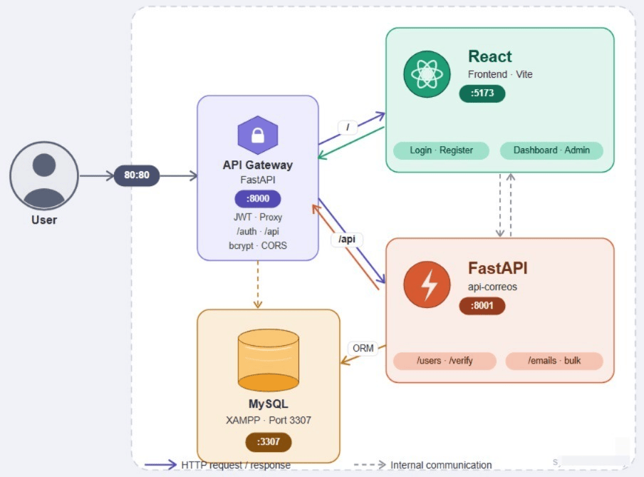

# User Management & Email System

A web platform that lets you register users, verify their identity by email, and send individual or bulk email campaigns — all through a secure, token-protected interface.

It is built as a **microservices architecture**: a React frontend talks to a central API Gateway, which handles authentication and routes traffic to a dedicated email microservice backed by a MySQL database.

---

## What it does

- Users can **register, log in, and verify** their account with a 4-digit code sent to their email.
- Admins can **view all users**, send **individual emails**, or **broadcast bulk campaigns** with rich HTML templates.
- Every protected route requires a **JWT token** issued at login.
- Passwords are never stored in plain text — they are hashed with **bcrypt**.

---

## Architecture



> The API Gateway is the **only service exposed** to the browser. The `api-correos` microservice runs internally and is never accessed directly from the frontend.

---

## Tech Stack

| Layer | Technology |
|---|---|
| Frontend | React 18, Vite, Axios |
| API Gateway | FastAPI, Uvicorn — `:8000` |
| Email Service | FastAPI, SQLAlchemy — `:8001` |
| Auth | JWT (`python-jose`), bcrypt (`passlib`) |
| Database | MySQL / MariaDB via XAMPP — `:3307` |
| Email delivery | SMTP, HTML templates |

---

## Project Structure

```
├── Back/
│   ├── api-gateway/       # Auth, JWT middleware, request proxy
│   └── api-correos/       # Users CRUD, email sending, DB models
└── frontend/              # React SPA (Vite)
```

---

## Getting Started

### Prerequisites

- Python 3.10+
- Node.js 18+
- XAMPP (MySQL/MariaDB)

---

### 1 — Database

Start XAMPP, open **phpMyAdmin**, and create a database named `email_system`.
Tables are created automatically by SQLAlchemy when the service starts.

> **If you use Oracle SQL Developer with XAMPP**, your MySQL port is likely `3307` instead of the default `3306`.
> Open `Back/api-correos/database.py` and set:
> ```python
> DATABASE_URL = "mysql+pymysql://root:@localhost:3307/email_system"
> ```
> Also add `innodb_file_per_table=1` to your XAMPP `my.ini` under `[mysqld]` to prevent table corruption.

---

### 2 — Environment variables

Create a `.env` file in each service folder:

**`Back/api-correos/.env`**
```
DB_HOST=localhost
DB_PORT=3307
DB_NAME=email_system
DB_USER=root
DB_PASSWORD=

SMTP_HOST=smtp.gmail.com
SMTP_PORT=587
SMTP_USER=your_email@gmail.com
SMTP_PASSWORD=your_app_password
```

**`Back/api-gateway/.env`**
```
SECRET_KEY=your_jwt_secret
ALGORITHM=HS256
ACCESS_TOKEN_EXPIRE_MINUTES=30
API_CORREOS_URL=http://localhost:8001
```

---

### 3 — Run the project

Open **three terminals** and run each service:

```bash
# Terminal 1 — Email service
cd Back/api-correos
pip install -r requirements.txt
uvicorn main:app --port 8001 --reload

# Terminal 2 — API Gateway
cd Back/api-gateway
pip install -r requirements.txt
uvicorn main:app --port 8000 --reload

# Terminal 3 — Frontend
cd frontend
npm install
npm run dev
```

Then open **http://localhost:5173** in your browser.

---

## API Endpoints

All requests from the frontend go through the Gateway at `:8000`.

| Method | Endpoint | Auth required | Description |
|---|---|---|---|
| `POST` | `/auth/register` | No | Create a new account |
| `POST` | `/auth/login` | No | Login and receive a JWT token |
| `POST` | `/auth/verify` | No | Submit the 4-digit verification code |
| `GET` | `/users` | Admin | List all registered users |
| `DELETE` | `/users/{id}` | Admin | Remove a user |
| `POST` | `/emails/send` | Yes | Send an email to one user |
| `POST` | `/emails/bulk` | Admin | Broadcast an email to all users |

---

## How authentication works

1. User registers → password is hashed with bcrypt and saved to the database.
2. A 4-digit code is generated and sent to their email via SMTP.
3. User submits the code → account is activated.
4. User logs in → the Gateway returns a signed JWT token (30 min expiry).
5. The frontend attaches the token as `Authorization: Bearer <token>` on every request.
6. The JWT middleware in the Gateway validates the token before forwarding the request.

---

## Troubleshooting

**`bcrypt` error on startup** — Pin these versions in `requirements.txt`:
```
passlib==1.7.4
bcrypt==4.0.1
```

**Duplicate CORS headers** — Make sure CORS middleware is only configured in one place. Do not set it in both the Gateway and `api-correos`.

**MySQL won't start after a crash** — Add `innodb_file_per_table=1` to `my.ini` and restart XAMPP. If a specific table is corrupted, delete its `.ibd` file and let SQLAlchemy recreate it.

---

## License

MIT
